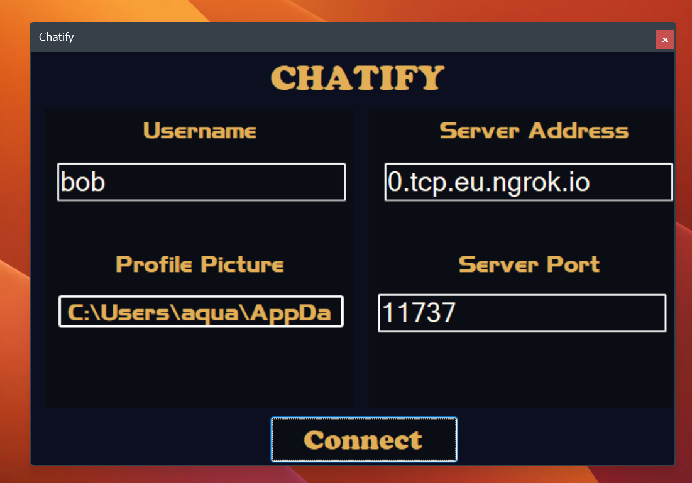
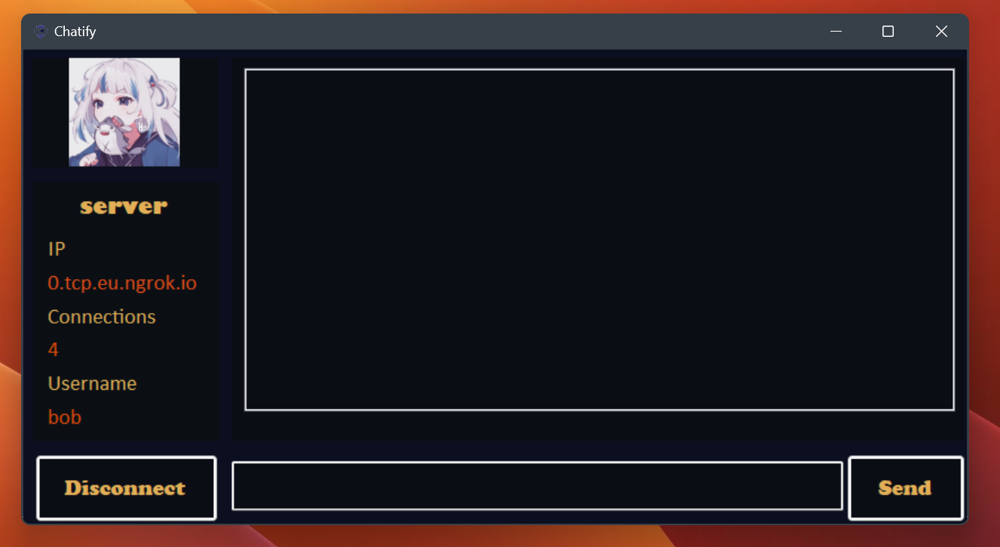

## Welcome to Chatify 🚀

Chatify is an online chatting application designed for Windows users, providing a seamless and intuitive platform for real-time communication. With Chatify, users can connect with friends, colleagues, or family members effortlessly, no matter where they are.

## Table of Contents
- [Key Features](#key-features)
- [Installation](#installation)
- [Usage](#usage)
- [Contributing](#contributing)

## Key Features
1. **Real-Time Messaging:** Enjoy instant messaging with friends and groups in real-time, making communication efficient and interactive.
2. **User-Friendly Interface:** Chatify boasts a sleek and intuitive interface, ensuring a seamless user experience for both novice and experienced users.
3. **Customization Options:** Personalize your chatting experience with customizable themes, emojis, and notification settings, making Chatify truly yours.
4. **Security and Privacy:** Rest assured knowing that your conversations are secure and private with Chatify's robust encryption protocols.

## Installation

1. Clone the repository to your local machine.
2. Install the necessary dependencies.
3. Build and run Chatify on your Windows system.
4. Start chatting with your friends and enjoy the seamless experience!

## Usage

Add instructions on how to use Chatify here.

## Contributing

We welcome contributions from the community to help improve Chatify further. Whether it's fixing bugs, adding new features, or enhancing the UI, your contributions are highly appreciated. Please check out our contribution guidelines for more information.
